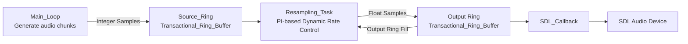

# gade_sdl
A SDL front end in Ada for Libgade

## Audio Pipeline

The front end uses a form of [Dynamic Rate Control](https://docs.libretro.com/development/cores/dynamic-rate-control/) to sync the audio to the video.

1. `Runtime.Main_Loop` produces emulator audio in chunks (`Producer_Chunk_Samples`), inside `Generate`.
2. It calls `Audio.IO.Queue_Asynchronously` to hand off each chunk.
3. `Audio.IO.Queue_Asynchronously` writes raw `Stereo_Sample` data into `Source_Ring` (`Buffers.Transactional_Ring.Transactional_Ring_Buffer`).
4. `Audio.IO.Resampling_Task` runs concurrently:
   - reads from `Source_Ring`,
   - computes fill error from `Output_Ring` level (`Audio.Callback.Level`),
   - applies PI-based dynamic rate control ([PID](https://en.wikipedia.org/wiki/Proportional%E2%80%93integral%E2%80%93derivative_controller) without the D/derivative: Proportional_Gain, Integral_Gain, clamped by Max_Delta),
   - resamples via `Audio.Resampler` (cubic interpolation),
   - writes float stereo frames into `Output_Ring` (another transactional ring).
5. `Audio.Callback.SDL_Callback` is consumer-only:
   - drains output Ring into SDL’s output buffer,
   - writes silence for any remainder (underrun protection).

So the data flow is:

