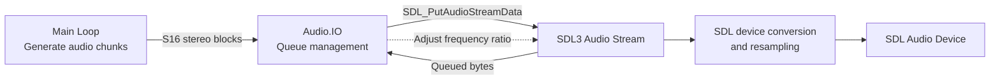

[](https://ada-lang.io/)
[](https://github.com/ohenley/awesome-ada)

# Gade SDL


A [SDL](https://www.libsdl.org/) front end in Ada for [Gade](https://github.com/ellamosi/gade), intended as a minimal, easily portable reference implementation.

## Usage

### Build

This setup has been tested on macOS with SDL3 so far.

Build using [Alire](https://alire.ada.dev/):

```sh
alr build
```

The local sibling-development setup in this repository pins
[`gade`](https://github.com/ellamosi/gade) and `sdl3ada` from `../gade` and
`../sdl3ada`. The frontend now targets SDL3 through `sdl3ada`, not SDL2 through
`sdlada`.

On macOS, the current baseline assumes SDL3 `release-3.4.4` is installed
through MacPorts in `/opt/local/lib`. On other platforms, make sure the SDL3
runtime and development libraries are available to the toolchain before
building.

The executable is generated at `bin/gade`.

### Run

```sh
bin/gade [options] [rom_file]
```

If `rom_file` is omitted, the app starts and waits for a ROM to be dropped on the window.

### Options

- `-u`, `--uncapped`: run without frame-rate cap.
- `-l=<level>`, `--log=<level>`: SDL log priority (for example `debug`, `info`, `warn`, `error`).
- `-h`, `--help`: show help.

### Examples

```sh
bin/gade path/to/game.gb
bin/gade --uncapped path/to/game.gb
bin/gade --log=debug path/to/game.gb
```

### Controls

- `Z`: A
- `X`: B
- `Enter`: Start
- `Backspace`: Select
- `Arrow keys`: D-Pad
- `Space`: Fast-forward (hold)

## Audio Pipeline

The front end now feeds the emulator's native `S16 stereo @ 1048576 Hz` sample
stream directly into an SDL3 audio stream and lets SDL handle any output-device
conversion or resampling.

1. `Runtime.Main_Loop` produces emulator audio in chunks (`Producer_Chunk_Samples`) inside `Generate`.
2. It calls `Audio.IO.Queue_Asynchronously` to hand off each chunk.
3. `Audio.IO.Queue_Asynchronously` writes the generated `Stereo_Sample` block straight into the SDL3 playback stream with `SDL_PutAudioStreamData`.
4. `Audio.IO` tracks the queued byte depth and derives:
   - a target queue depth that keeps some latency headroom,
   - a hard queue cap so latency cannot grow without bound.
5. A small PI-style drift controller adjusts SDL3's stream frequency ratio around `1.0`
   ([PID](https://en.wikipedia.org/wiki/Proportional%E2%80%93integral%E2%80%93derivative_controller)
   without the D/derivative: `Drift_Proportional_Gain`,
   `Drift_Integral_Gain`, clamped by `Max_Drift_Ratio_Delta`):
   - if the queue grows above target, the stream consumes input slightly faster,
   - if the queue falls below target, the stream consumes input slightly slower,
   - the correction is intentionally small and bounded (`±0.5%`).
6. If the queued input reaches the hard cap, `Audio.IO` briefly waits before queuing more data.

This keeps the SDL3 stream latency bounded without rebuilding the old SDL2-era
callback, float ring buffer, or custom cubic resampler path.

So the data flow is:


