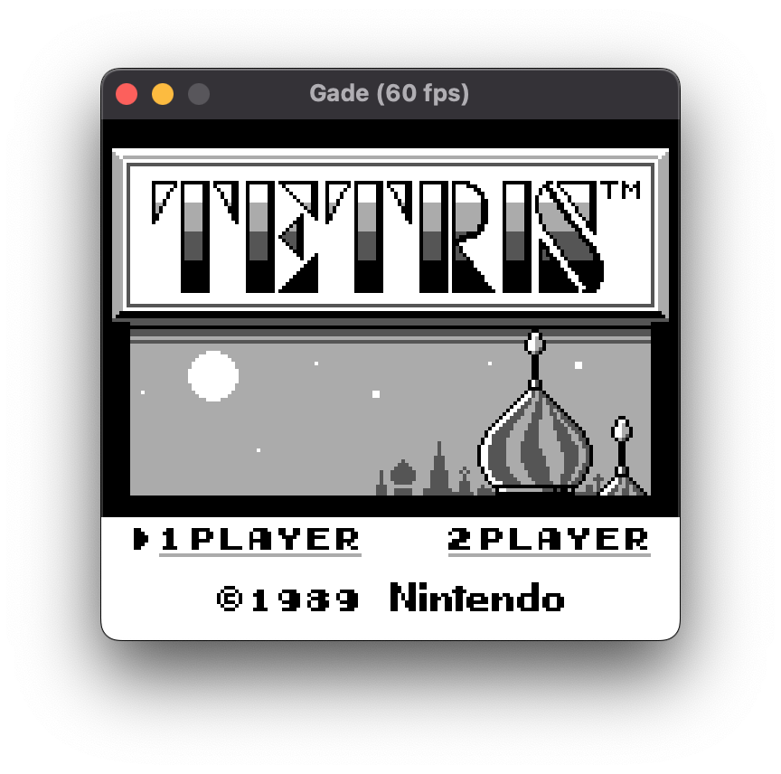
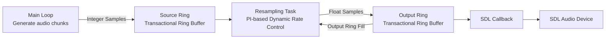

# Gade SDL



A [SDL](https://www.libsdl.org/) front end in Ada for [libgade](https://github.com/ellamosi/libgade), intended as an easily portable reference implementation.

## Dependencies

- Alire
- [libgade](https://github.com/ellamosi/libgade) (sibling project dependency)
- [SDLAda](https://github.com/ada-game-framework/sdlada) (Alire crate dependency)
  - Which in turn depends on SDL2

## Usage

### Build

This setup has been tested only on macOS 12 so far.

From this repository directory (`gade_sdl`):

```sh
alr build
```

The executable is generated at `bin/gade`.

This Alire migration keeps `libgade` as a local sibling dependency through GPR:

- `../libgade/gade.gpr`

### Run

```sh
bin/gade [options] [rom_file]
```

If `rom_file` is omitted, the app starts and waits for a ROM to be dropped on the window.

### Options

- `-u`, `--uncapped`: run without frame-rate cap.
- `-l=<level>`, `--log=<level>`: SDL log priority (for example `debug`, `info`, `warn`, `error`).
- `-h`, `--help`: show help.

### Examples

```sh
bin/gade path/to/game.gb
bin/gade --uncapped path/to/game.gb
bin/gade --log=debug path/to/game.gb
```

### Controls

- `Z`: A
- `X`: B
- `Enter`: Start
- `Backspace`: Select
- `Arrow keys`: D-Pad
- `Space`: Fast-forward (hold)

## Audio Pipeline

The front end uses a form of [Dynamic Rate Control](https://docs.libretro.com/development/cores/dynamic-rate-control/) to sync the audio to the video.

1. `Runtime.Main_Loop` produces emulator audio in chunks (`Producer_Chunk_Samples`), inside `Generate`.
2. It calls `Audio.IO.Queue_Asynchronously` to hand off each chunk.
3. `Audio.IO.Queue_Asynchronously` writes raw `Stereo_Sample` data into `Source_Ring` (`Buffers.Transactional_Ring.Transactional_Ring_Buffer`).
4. `Audio.IO.Resampling_Task` runs concurrently:
   - reads from `Source_Ring`,
   - computes fill error from `Output_Ring` level (`Audio.Callback.Level`),
   - applies PI-based dynamic rate control ([PID](https://en.wikipedia.org/wiki/Proportional%E2%80%93integral%E2%80%93derivative_controller) without the D/derivative: Proportional_Gain, Integral_Gain, clamped by `Max_Delta`),
   - resamples via `Audio.Resampler` (cubic interpolation),
   - writes float stereo frames into `Output_Ring` (another transactional ring).
5. `Audio.Callback.SDL_Callback` is consumer-only:
   - drains output Ring into SDL’s output buffer,
   - writes silence for any remainder (underrun protection).

So the data flow is:


